# AI智学教学辅助平台

> 基于 Next.js + React 构建的 AI 教学辅助前端项目，面向教师与学生两类用户，提供智能对话、课程工作台、知识库、作业练习、数据分析以及多模态内容生成等能力。

## 项目介绍

AI智学教学辅助平台是一个围绕教学与学习场景设计的 AI 辅助系统前端。项目通过统一的 AI 对话入口连接智能问答、文件上传、课程知识库和多模态生成能力，并结合教师工作台、学生工作台、课程管理、作业练习、学习数据分析、AI 通识课等模块，为教学和学习提供一站式辅助支持。

系统支持两种角色：

- **教师**：用于课程建设、学生管理、知识库维护、作业练习管理、教学数据查看和教学素材生成。
- **学生**：用于课程学习、资料查看、作业练习、学习数据查看和 AI 学习辅助。

### 项目演示视频

[项目演示视频](https://s3.chuangyu-tech.top/AI%E6%99%BA%E5%AD%A6.mp4)
<video src="https://s3.chuangyu-tech.top/AI%E6%99%BA%E5%AD%A6.mp4" width="100%" height="100%" controls></video>

### Graph架构

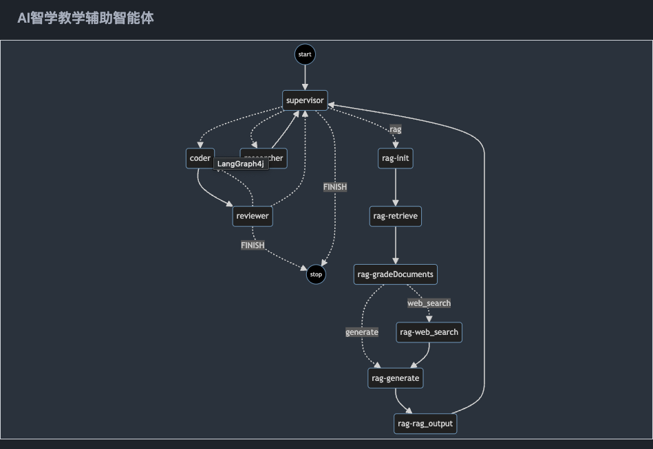

## 项目特点

- **双角色工作台**：根据用户身份展示教师端或学生端工作台。
- **AI 智能对话**：支持连续对话、历史会话、文件上传、热门问题和知识库问答。
- **课程专属知识库**：支持选择课程知识库，让 AI 回复更贴近课程内容。
- **多模态内容生成**：支持 PPT 生成、图片生成、视频生成等 AI 创作能力。
- **课程教学管理**：支持课程、学生、知识库、作业练习等教学资源管理。
- **数据分析能力**：为教师和学生提供课程数据、学习数据相关入口。
- **现代化交互体验**：使用 Ant Design、Ant Design X、Framer Motion 等实现良好的界面与动效。

## 技术栈

| 分类 | 技术 |
| --- | --- |
| 前端框架 | Next.js 16、React 19 |
| 包管理器 | pnpm |
| UI 组件库 | Ant Design 6、Ant Design X |
| 样式方案 | CSS Modules、Tailwind CSS、Ant Design CSS-in-JS |
| 动画 | Framer Motion、canvas-confetti、react-canvas-confetti |
| 网络请求 | Axios |
| Markdown/数学公式 | react-markdown、marked、remark-gfm、remark-math、rehype-katex、KaTeX |
| 代码高亮 | react-syntax-highlighter |
| 图表 | Recharts |
| 文档/富文本 | Quill、React Quill、TipTap、docx、html-to-docx、file-saver |
| 可视化 | Mermaid |
| 工程化 | ESLint、TypeScript、Next.js Pages Router |

## 开发环境

| Node.js | pnpm    |
|---------|---------|
| 22.12.0 | 10.11.0 |

## 安装使用方法

> 本项目仅支持使用 `pnpm` 安装依赖和运行脚本。

### 1. 克隆项目

```bash
git clone <项目仓库地址>
cd teach-ai-react
```

### 2. 安装依赖

```bash
pnpm install
```

### 3. 配置环境变量

在项目根目录创建 `.env.local` 文件，并根据实际后端服务补充配置：

```bash
NEXT_PUBLIC_API_URL_LOC=<后端服务地址>
NEXT_PUBLIC_FETCH_API_URL=<文件上传服务地址>
```

配置说明：

- `NEXT_PUBLIC_API_URL_LOC`：用于 Next.js rewrites，将前端 `/client-api/*` 请求代理到真实后端服务。
- `NEXT_PUBLIC_FETCH_API_URL`：用于文件上传接口，例如聊天附件上传、PPT 文件上传等。

### 4. 启动开发服务

```bash
pnpm dev
```

启动后访问：

```text
http://localhost:3000
```

项目首页会重定向到登录页：

```text
http://localhost:3000/login
```

### 5. 构建生产版本

```bash
pnpm build
```

### 6. 启动生产服务

```bash
pnpm start
```

### 7. 代码检查

```bash
pnpm lint
```

## 主要功能介绍

### 通用功能

#### 用户登录与注册

- 支持账号密码登录。
- 登录页包含滑块验证与登录成功动效。
- 支持新用户注册。
- 登录后保存用户信息，并根据用户角色进入对应功能。

#### 路由鉴权

- `/login` 和 `/register` 为白名单页面。
- 其他页面需要登录后访问。
- 未登录或登录失效时自动跳转到登录页。

#### AI 对话中心

- 支持创建新会话。
- 支持查看历史会话。
- 支持连续对话与流式响应展示。
- 支持文件上传作为上下文。
- 支持热门问题快捷提问。
- 支持通用模式与课程专属知识库模式。

#### AI 多模态生成

- **PPT 生成**：根据主题生成 PPT 大纲，支持大纲编辑、附件上传和导出。
- **图片生成**：根据提示词生成图片，支持任务轮询和图片下载。
- **视频生成**：根据提示词生成视频，支持比例、时长选择、视频下载和 GIF 导出。

#### AI 通识课

- 提供 AI 通识课入口。
- 支持课程首页、章节列表和课时详情页面。
- 教师端和学生端均可从课程详情中进入。

### 角色一：教师端

教师端主要用于教学管理、课程建设和教学辅助。

#### 教师工作台

- 查看教师负责的课程列表。
- 创建课程并关联课程组。
- 编辑课程信息。
- 删除课程。
- 进入课程详情管理页。

#### 课程详情管理

- **数据分析**：查看课程教学数据与统计信息。
- **学生管理**：管理课程学生信息。
- **知识库管理**：维护课程资料、知识库内容和教学资源。
- **作业练习**：创建、管理和查看课程作业练习。
- **AI 通识课**：进入 AI 通识课模块。

#### 教学辅助能力

- 基于课程知识库进行 AI 问答。
- 上传教学资料，让 AI 结合附件上下文回答。
- 使用 PPT 生成功能辅助备课。
- 使用图片和视频生成功能制作教学素材。

### 角色二：学生端

学生端主要用于课程学习、学习辅助和作业练习。

#### 学生工作台

- 查看学生自己的课程列表。
- 查看课程名称、课程分组、学生数量等信息。
- 点击课程进入学习详情页。

#### 课程学习详情

- **数据分析**：查看个人学习情况与课程相关数据。
- **知识库/资料查看**：查看课程知识库和学习资料。
- **作业练习**：进入课程作业练习模块。
- **AI 通识课**：进入 AI 通识课学习模块。

#### 学习辅助能力

- 使用通用 AI 对话进行问题咨询。
- 使用课程专属知识库进行精准问答。
- 使用 PPT、图片、视频生成工具辅助学习表达和内容创作。

## 项目结构

```text
teach-ai-react
├── public/                     # 静态资源
├── src/
│   ├── api/                    # 接口请求模块
│   ├── assets/                 # 图片等资源
│   ├── components/             # 通用组件与业务组件
│   │   ├── workspace/          # 教师工作台组件
│   │   ├── student-workspace/  # 学生工作台组件
│   │   └── aicourse/           # AI 通识课组件
│   ├── lib/                    # 静态数据与工具方法
│   ├── pages/                  # Next.js Pages Router 页面
│   ├── styles/                 # 全局样式与 CSS Modules
│   ├── theme/                  # 主题相关配置
│   ├── types/                  # TypeScript 类型定义
│   └── utils/                  # 请求、环境、用户工具
├── next.config.ts              # Next.js 配置
├── package.json                # 项目依赖与脚本
├── pnpm-lock.yaml              # pnpm 锁定文件
└── tsconfig.json               # TypeScript 配置
```

## 后端架构

### 后端主要负责什么

- **AI 对话能力**：支持流式聊天、多轮上下文、历史会话与课程知识库问答。
- **知识库增强能力**：对课程资料、教师上传文件进行解析、切分、向量化与召回，支撑 RAG 检索。
- **多模态生成能力**：提供 PPT、教案、图片、视频等内容生成能力。
- **教学业务能力**：提供课程、学生、作业练习、学情分析、知识库管理等接口服务。
- **文件与任务处理能力**：负责上传文件解析、对象存储、异步生成任务和结果回传。

### AI 实现链路

后端 AI 实现可以概括为一条清晰的处理链路：

**用户输入 → 文件解析 → 知识库检索 → 教学意图理解 → 内容生成 → 前端展示**

具体流程如下：

1. **接收输入**：接收文本、语音转写内容以及上传的教学资料。
2. **解析资料**：提取 PDF、Word、PPT、图片、视频等文件中的有效内容。
3. **构建知识上下文**：对资料进行清洗、分块、向量化，并写入向量数据库。
4. **执行 RAG 检索**：根据当前提问或生成任务，从课程知识库中召回相关内容。
5. **理解教学意图**：结合用户输入、多轮对话历史和检索结果，提炼教学目标、知识点、重点难点和内容结构。
6. **生成结果**：输出聊天回复、PPT 大纲、教案、图片或视频等内容。
7. **返回前端**：聊天类能力通常以流式方式返回，生成类能力通常通过异步任务或轮询方式返回结果。

### 关键技术组成

| 类别 | 说明 |
| --- | --- |
| 微服务框架 | Spring Boot、Spring Cloud Alibaba |
| AI 编排 | LangChain4j |
| 向量检索 | Milvus |
| 业务数据存储 | MySQL |
| 缓存与会话 | Redis |
| 历史记录/中间数据 | MongoDB |
| 文件存储 | S3 兼容对象存储 |
| 异步任务 | RocketMQ、定时任务调度 |

### 安全与部署说明

- 使用 **JWT + Redis** 实现登录认证与会话管理。
- 支持基于角色的权限控制，适配管理员、教师、学生等不同身份。
- 对敏感教学数据可采用 **本地模型 + 云端模型** 的混合处理方式，兼顾安全性与生成效果。
- 通过网关、缓存、消息队列、向量数据库和对象存储等组件协同，支撑较高并发场景下的 AI 交互与内容生成。

## 项目截图

### 登录页面

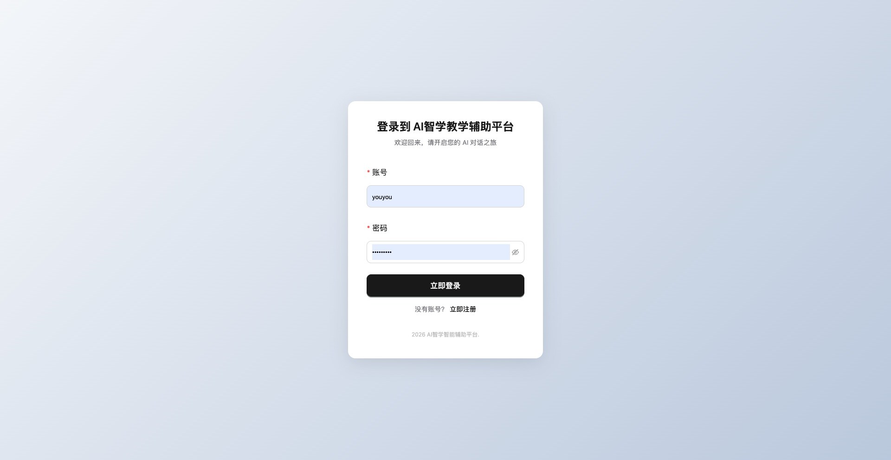

### AI 对话页面

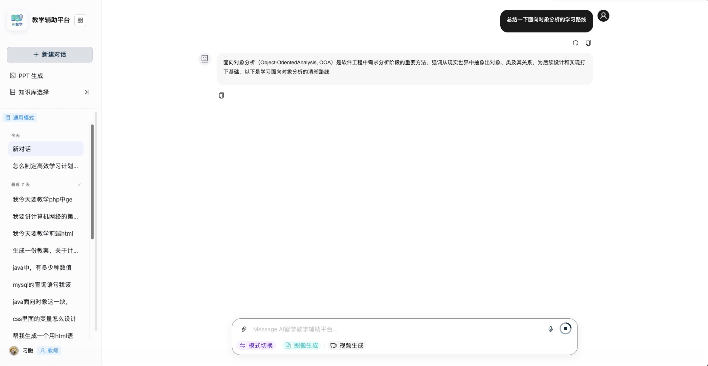

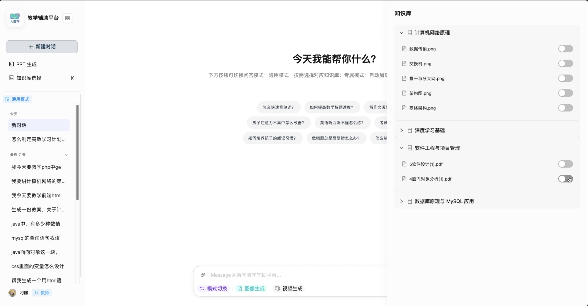

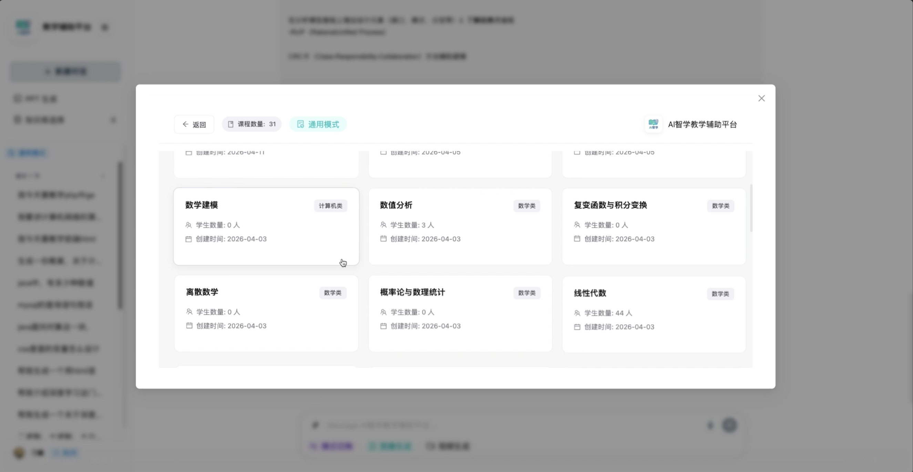

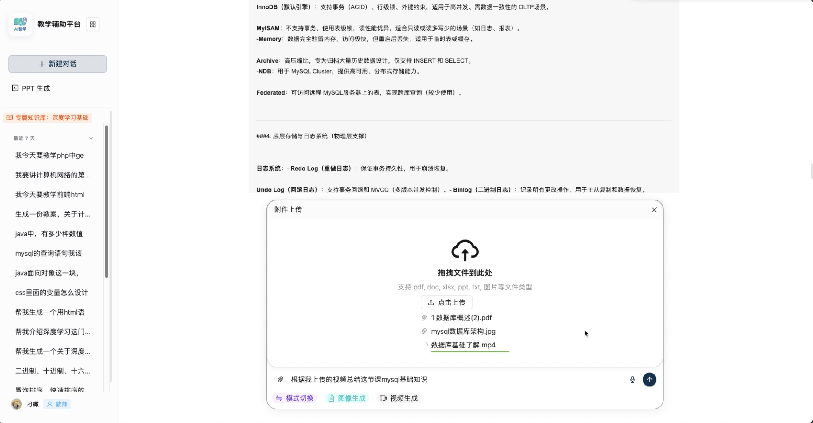

### 工作台（教师）

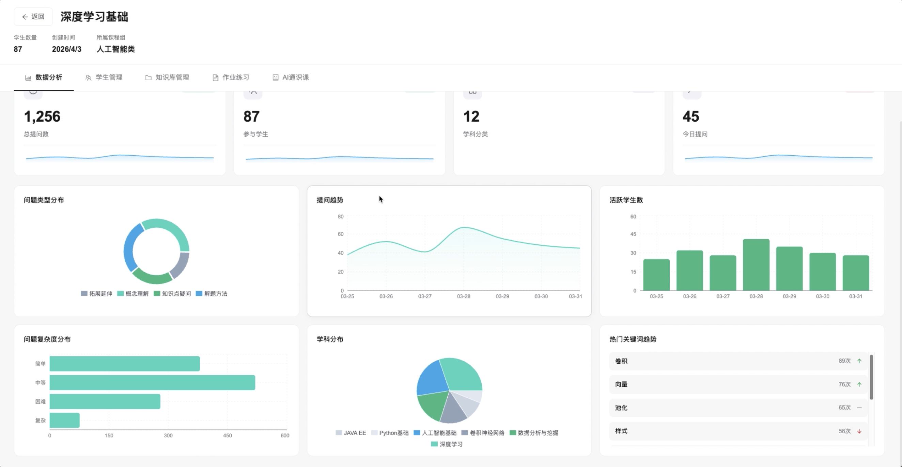

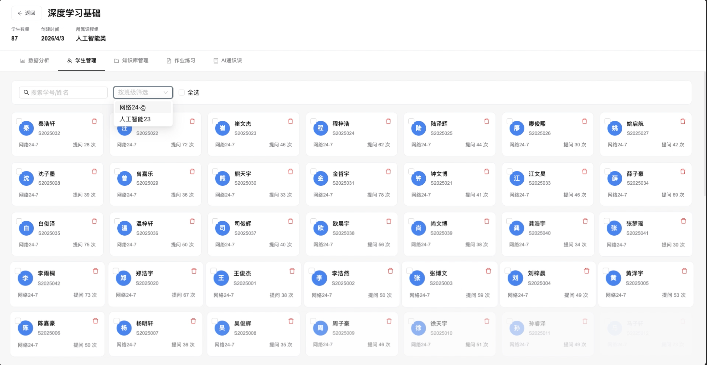

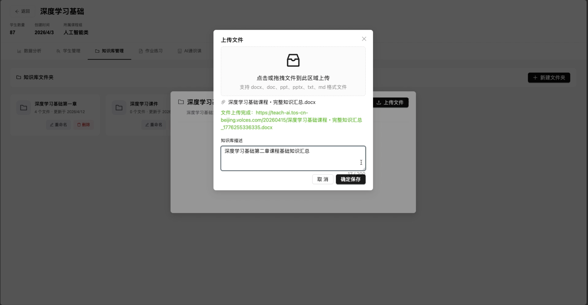

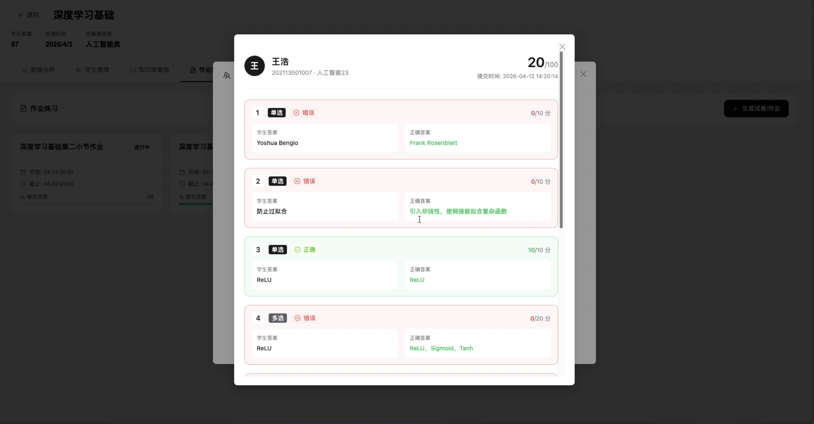

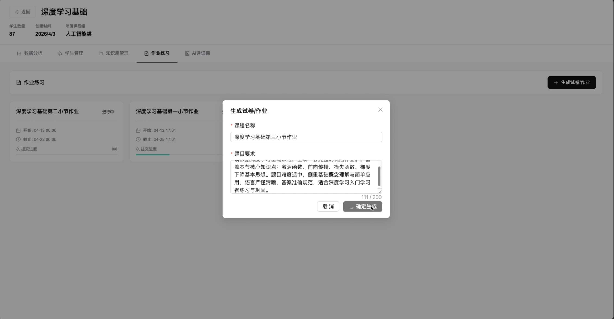

### AI通识课

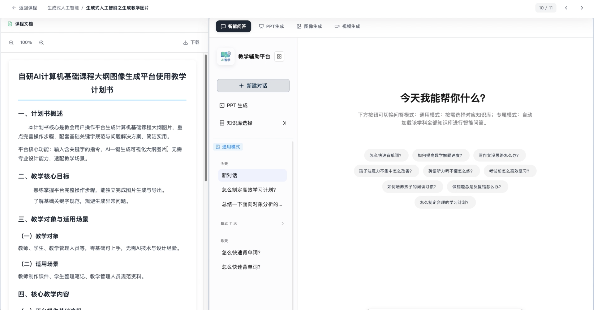

### PPT 生成页面

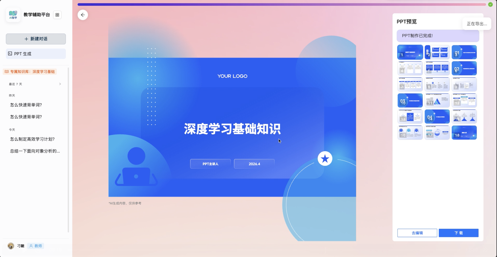

### 图片/视频生成页面

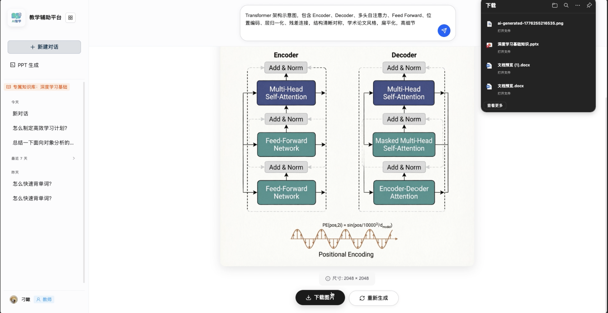

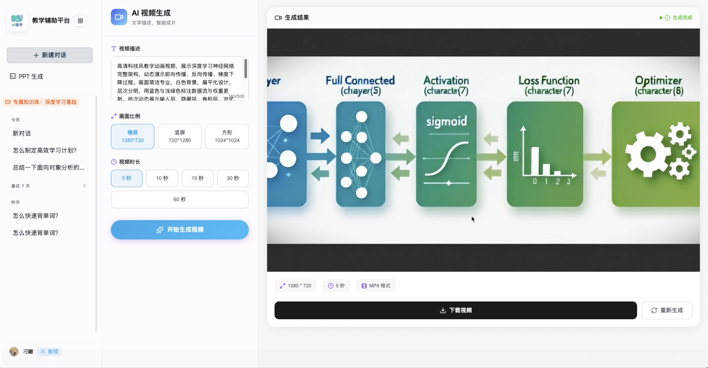
